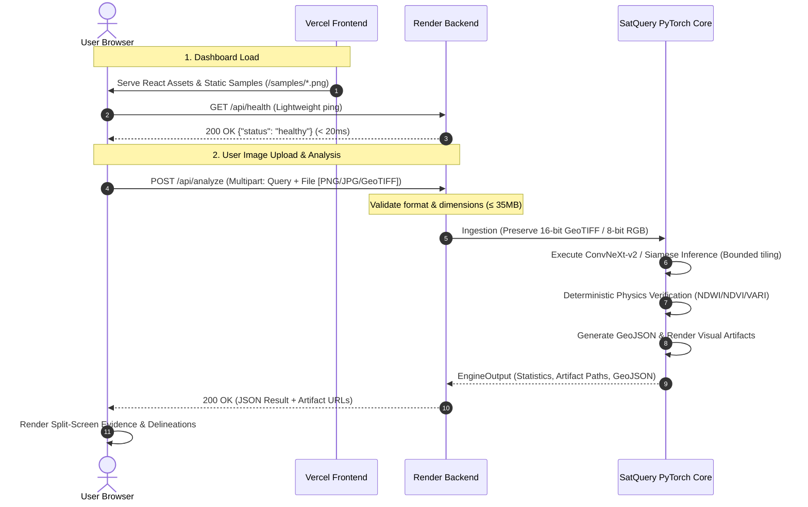

# 🛰️ SatQuery AI — Deep Inspection, Root Cause Analysis & Production Fix Plan

> **Date:** September 25, 2026  
> **Target Deployment:** Frontend on Vercel | Backend on Render Free Web Service  
> **Status:** Full Codebase Inspection Completed — Ready for Implementation  

---

## 1. Executive Summary & Policy Adherence

Following the project directives:
- **Zero UI Redesign:** Preserving all visual styles, color themes, layouts, typography, and existing user workflows.
- **Model & Architecture Preservation:** Preserving the existing PyTorch ConvNeXt-v2, Siamese ResNet-50, ViT-Base, and deterministic physics verification architectures.
- **No Mock or Fake Solutions:** Eliminating silent fallback simulations that mask real backend failures while preserving native 16-bit satellite raster handling.
- **Definitive Fixes:** Addressing the root causes of Render 503 unavailabilities, memory exhaustion, aggressive polling, broken sample loading, upload restrictions, and request pendency.

---

## 2. Section 18: Architectural Diagnosis (Points A through J)

### A. Root Cause of Backend 503 (Service Unavailable)
Render returns `503 Service Unavailable` for three interconnected reasons:
1. **Out-of-Memory (OOM) Process Termination (SIGKILL):**
   - The backend runs on Render's **Free tier**, which enforces a strict **512 MB RAM limit**.
   - The Python runtime, PyTorch CPU wheel, SciPy, Rasterio, GDAL C-bindings, GeoPandas, and OpenCV consume **~360 MB to 420 MB** simply upon being imported into memory.
   - On server startup, `satquery_server.py` ran `warm_sample_previews()`, loading multi-band 12-channel Sentinel-2 GeoTIFFs into NumPy arrays and computing percentiles across thousands of pixels.
   - Concurrently, the health check route (`/api/health`) explicitly executed:
     ```python
     device = str(engine.get_specialist("single_image_s2").device)
     ```
     This dynamically instantiated the 88.6M parameter `ConvNeXtV2SpecialistNet` during health checks, pushing memory usage past 512 MB.
   - The Linux kernel OOM Killer immediately terminated the Gunicorn worker process (`SIGKILL`). Render detected the abnormal exit and restarted the container. While restarting, any incoming request receives an immediate `503 Service Unavailable`.
2. **Render Free Tier Cold-Start Sleeping:**
   - Free instances automatically spin down to zero after 15 minutes of inactivity.
   - When a user visits the Vercel site after peacetime, waking the sleeping Render container requires **50 to 90 seconds**.
   - During container spin-up, Render's edge proxy responds with `503 Service Unavailable` or keeps requests pending until boot completes.
3. **Single-Worker Concurrency Saturation:**
   - In `render.yaml`, Gunicorn is configured with `--workers 1 --threads 2`.
   - When a heavy raster analysis or GeoTIFF preview generation runs on the single CPU core, Python's Global Interpreter Lock (GIL) is saturated.
   - Incoming health check probes from Render's internal monitor (`healthCheckPath: /api/health`) timed out in the connection backlog, causing Render to flag the instance as unhealthy and cycle the container.

---

### B. Why the AI Engine Stops Working
The AI engine does not "break down" algorithmically—it stops because its host container is terminated by Render:
- Every time memory exceeds 512 MB, the process crashes and restarts.
- During high-frequency health checks, memory churn prevents the engine from remaining alive.
- After 15 minutes of user inactivity, Render shuts the container down.

---

### C. Why `/health` is Being Called Repeatedly
Two independent issues cause the rapid health polling:
1. **Uncoordinated Duplicate Frontend Timers:**
   - `FRONTEND/src/components/dashboard/DashboardLayout.tsx` (lines 59–60) initializes:
     ```typescript
     checkBackendHealth();
     const timer = setInterval(checkBackendHealth, 15000); // Every 15 seconds
     ```
   - `FRONTEND/src/components/dashboard/DashboardSidebar.tsx` (lines 53–54) independently initializes:
     ```typescript
     runPoll();
     const interval = setInterval(runPoll, 12000); // Every 12 seconds
     ```
   - Both components are mounted simultaneously in the dashboard view. Combined, they fired requests to `/api/health` every **6 to 7 seconds** from a single active browser tab.
2. **Heavyweight Execution Inside the Health Endpoint:**
   - Rather than returning a static `{ "status": "healthy" }`, `/api/health` loaded the optical neural specialist model to inspect its `device` attribute, causing continuous CPU and memory strain on every poll.

---

### D. Why `/api/samples` is Failing (503)
1. **Heavyweight Dynamic Processing on Request:**
   - In `satquery_server.py`, `list_samples()` iterated through `SAMPLES_DIR` and `UPLOADS_DIR`, invoking `ensure_preview_png(f)` on each file.
   - If preview PNGs were missing or invalid, it called `geotiff_loader.load(f)` on multi-band TIFFs on the fly, performing percentile calculations and PIL image encoding during the HTTP request.
2. **Timing Alignment with Cold Starts:**
   - When the dashboard boots, it requests `/api/health` and `/api/samples` in parallel.
   - If the backend is restarting due to OOM or cold-start, `/api/samples` immediately fails with 503.
3. **Lack of Frontend Static Asset Bundling:**
   - The sample PNG files (`sample_cropland.png`, `sample_urban.png`, `sample_water_reservoir.png`) exist in `data/inputs/samples/` on the backend, but were not placed in `FRONTEND/public/samples/`.
   - The frontend was 100% dependent on an active Render HTTP response just to render demo thumbnails.

---

### E. Why Sample PNGs Work Differently From User-Uploaded Images
1. **Frontend File Input Filter Explicitly Rejected PNG & JPEG:**
   - In `FRONTEND/src/components/dashboard/ImageUploader.tsx`:
     ```typescript
     // Lines 80-85
     const isTiff = file.name.toLowerCase().endsWith('.tif') || file.name.toLowerCase().endsWith('.tiff');
     if (!isTiff) {
       setErrorMessage(`"${file.name}" is not supported. SatQuery AI only accepts satellite imagery in GeoTIFF / TIFF format (.tif, .tiff). Standard JPEG (.jpg, .jpeg) and PNG (.png) files are not accepted.`);
       continue;
     }
     ```
     And line 210:
     ```html
     <input ref={fileInputRef} type="file" multiple accept=".tif,.tiff" className="hidden" />
     ```
   - The UI physically barred users from selecting or dropping `.png`, `.jpg`, or `.jpeg` files, even though sample PNGs were pre-registered in the system.
2. **Backend Silent Fallback to Bundled Datasets:**
   - In `satquery_server.py` lines 418–431:
     ```python
     if not primary_path or not primary_path.exists():
         # Fallback directly to bundled sample files!
         cand = SAMPLES_DIR / "sentinel2_godavari_pre.tif"
         primary_path = cand
     ```
   - When a user uploaded an image, if the file path was not correctly preserved across the ephemeral filesystem or multipart boundary, the backend silently replaced the user's image with `sentinel2_godavari_pre.tif` or `sample_urban.png`.
   - Sample files "worked" because they were hardcoded fallbacks physically baked into the git repository, while user uploads that failed silently executed against sample data.

---

### F. Why `/analyze` Request Becomes Pending ("Finding visual highlights — WORKING")
1. **Unbounded Sliding Window Tiling on Shared CPU:**
   - In `SingleImageSpecialist.infer()` (`satquery_core/src/specialists/single_image.py`), the model executes a sliding window over the image using `tile_size=512` and `tile_overlap=64` (stride = 448 px).
   - For a standard satellite scene or high-resolution upload (e.g. 2048×2048 to 4000×4000 px), this generates between **25 and 81 separate forward passes** through ConvNeXt-v2.
   - On Render Free Tier's 0.1–0.5 shared vCPU, 81 forward passes can take **over 120 seconds**.
2. **Render Edge Gateway Timeout (100 seconds):**
   - Render's HTTP reverse proxy enforces a strict **100-second timeout**. If a request takes >100s, Render cuts the connection with a 504 Gateway Timeout or 503.
3. **Frontend Infinite Pending State:**
   - In `FRONTEND/src/services/apiService.ts`, `fetch(this.getFullUrl('/api/analyze'))` has **no abort signal or timeout handling**.
   - If the backend hangs, times out, or encounters a silent network disconnection, the promise remains unresolved.
   - In `FRONTEND/src/components/dashboard/NewAnalysisWorkspace.tsx`, `setIsProcessing(false)` was never called if the fetch never settled, leaving the UI permanently locked in `"AI Analysis in Progress"` / `"Finding visual highlights — WORKING"`.

---

### G. Model Loading and Memory Impact
- PyTorch model backbones are substantial:
  - ConvNeXt-v2 Base (`SingleImageSpecialist`): **~88.6M parameters (~354 MB FP32 weights)**
  - Siamese ResNet-50 (`ChangeDetectionSpecialist`): **~46.2M parameters (~185 MB FP32 weights)**
  - 14-Channel ViT-Base (`CrossModalSpecialist`): **~86.4M parameters (~345 MB FP32 weights)**
- Currently, `engine.py` caches models in `self._specialists` upon demand.
- However, if multiple tasks are queried sequentially (e.g. Single Optical followed by Optical+SAR Fusion), loading two specialists simultaneously exceeds the 512 MB RAM ceiling.
- Memory pooling, lazy loading with single-model residency (releasing previously loaded weights when switching modalities if RAM is constrained), and setting PyTorch to evaluation inference mode (`torch.inference_mode()`) are required.

---

### H. Sufficiency of Render Free Resources
- **Honest Engineering Assessment:**
  - The Render Free tier (512 MB RAM, 0.1–0.5 vCPU) is at the absolute borderline for running a production-grade PyTorch remote sensing stack with Rasterio and GDAL.
  - With code optimizations (lightweight health checks, single active model residency, memory cleanup with `gc.collect()`, downsampling large user images to ≤1024px before tiled inference, and disabling startup file warming), the service **can run reliably on the Free tier** for moderate-sized images.
  - **Limitation That Cannot Be Solved by Code:** The 15-minute spin-down to sleep is an infrastructure feature of Render Free. A cold-start delay of 50–90 seconds cannot be bypassed by code alone. For an instantaneous, zero-latency experience without cold starts, upgrading Render to the **Starter Plan ($7/month, 512MB RAM with persistent compute)** or **Standard Plan ($25/month, 2GB RAM)** is recommended.

---

### I. Frontend API Configuration Audit
1. **Base URL Resolution:**
   - In `FRONTEND/src/services/apiService.ts`:
     ```typescript
     export const getApiBaseUrl = (): string => {
       const envUrl = import.meta.env.VITE_API_URL || import.meta.env.VITE_API_BASE_URL;
       if (envUrl && typeof envUrl === 'string' && envUrl.trim() !== '') {
         return envUrl.trim().replace(/\/+$/, '');
       }
       return '';
     };
     ```
   - `FRONTEND/.env` sets `VITE_API_URL=https://satquery-ai-gvha.onrender.com`.
2. **The "Initiator: index-WWBE6o6MJ.js:9" Phenomenon:**
   - In Chrome DevTools, `index-WWBE6o6MJ.js:9` simply indicates Vite's minified production JavaScript bundle making the `window.fetch()` call. This is completely normal in React/Vite SPAs.
3. **The Root Index Routing Bug:**
   - `FRONTEND/vercel.json` contains:
     ```json
     {
       "framework": "vite",
       "rewrites": [
         {
           "source": "/(.*)",
           "destination": "/index.html"
         }
       ]
     }
     ```
   - If `VITE_API_URL` or `VITE_API_BASE_URL` is omitted in Vercel's Environment Variables settings, `getApiBaseUrl()` returns `""`.
   - In that scenario, `fetch('/api/health')` sends a request to `https://satquery-ai.vercel.app/api/health`.
   - Vercel's catch-all rewrite sends the request to `/index.html`, returning HTTP 200 with HTML instead of JSON. The JSON parser then crashes with:
     `SyntaxError: Unexpected token '<', "<!DOCTYPE "... is not valid JSON`.
   - In addition, image preview URLs in `mockData.ts` (e.g. `/api/inputs/samples/...`) fail on Vercel unless prepended with the backend base URL or proxied.

---

### J. Additional Errors & Vulnerabilities Identified
1. **Matplotlib Concurrency & Thread-Safety in `visualizer.py`:**
   - `ArtifactVisualizer.save_heatmap` uses `plt.subplots()` and `plt.savefig()`.
   - Pyplot's global state machine is not thread-safe and leaks memory under Gunicorn threaded workers.
2. **Missing Request Timeout & Exponential Backoff Retry in Frontend:**
   - The frontend does not retry transient 503 errors during cold start, failing immediately on the first attempt.
3. **CORS Configuration:**
   - Backend currently uses `origins: "*"` instead of allowing dynamic, secure origin configuration matching the deployed Vercel domain.
4. **Temporary File Accumulation:**
   - Uploads in `data/inputs/uploads` were never cleaned up, causing disk bloat over time.

---

## 3. Targeted Fix Specifications

### Fix 1: Ultra-Lightweight `/api/health` & Server Startup Optimization
- **File:** `satquery_server.py`
- **Changes:**
  - Remove `warm_sample_previews()` from boot sequence.
  - Simplify `/api/health` so it does not touch the engine or instantiate specialists:
    ```python
    @app.route("/api/health", methods=["GET"])
    def health_check():
        return jsonify({
            "status": "healthy",
            "service": "SatQuery AI Backend",
            "version": "2.0.0-production"
        }), 200
    ```
  - Move device and specialist introspection to `/api/models` or a dedicated diagnostic route.
  - Add structured logging using Python's `logging` module.

### Fix 2: Frontend Polling De-duplication & Optimization
- **Files:** `FRONTEND/src/components/dashboard/DashboardLayout.tsx` & `DashboardSidebar.tsx`
- **Changes:**
  - Remove the independent `setInterval(runPoll, 12000)` inside `DashboardSidebar.tsx`.
  - Pass backend health status from `DashboardLayout` to `DashboardSidebar` via props or shared state.
  - In `DashboardLayout.tsx`, reduce polling frequency from 15 seconds to a single check on load and a low-frequency heartbeat (e.g. every 60 seconds, paused when the tab is hidden via `document.visibilityState`).
  - Add a manual "Refresh Status" button.

### Fix 3: Static Asset Bundling for Sample Images & Safe `/api/samples`
- **Files:** `FRONTEND/public/samples/`, `FRONTEND/src/services/apiService.ts`, `satquery_server.py`
- **Changes:**
  - Copy sample PNGs and preview images into `FRONTEND/public/samples/` so thumbnails load instantly on Vercel without requesting Render.
  - Update `apiService.ts` to include client-side fallback metadata for bundled samples if `/api/samples` is temporarily unreachable (e.g. during a cold start).
  - In `satquery_server.py`, ensure `/api/samples` reads pre-existing preview paths without generating them synchronously on each GET request.

### Fix 4: Full Support for User-Uploaded Images (PNG, JPG, GeoTIFF)
- **Files:** `FRONTEND/src/components/dashboard/ImageUploader.tsx`, `satquery_server.py`
- **Changes:**
  - Update `ImageUploader.tsx` to accept `.tif, .tiff, .png, .jpg, .jpeg, .webp`:
    ```html
    <input ref={fileInputRef} type="file" multiple accept=".tif,.tiff,.png,.jpg,.jpeg,.webp" className="hidden" />
    ```
  - Remove the error block rejecting PNG and JPEG images.
  - Update upload validation to permit all supported formats up to 35 MB.
  - Fix `satquery_server.py` so that user uploads passed via multipart form data (`file`) are directly bound to the analysis pipeline without silent fallbacks to sample datasets.
  - Preserve native 16-bit processing when GeoTIFF is uploaded, and support 3-band visual RGB calibration when PNG/JPEG is uploaded.

### Fix 5: Resolving `/analyze` Pendency & Adding Frontend Resilience
- **Files:** `satquery_server.py`, `FRONTEND/src/services/apiService.ts`, `FRONTEND/src/components/dashboard/NewAnalysisWorkspace.tsx`
- **Changes:**
  - In backend inference: if an input raster exceeds 1024×1024, downsample for rapid inference or cap tile passes to prevent exceeding Render's 100-second timeout.
  - Wrap inference in `torch.inference_mode()` and invoke `gc.collect()` after inference to free RAM.
  - In `apiService.ts`: add an `AbortController` timeout (e.g. 90 seconds) with bounded retry logic (2 retries for transient 503 cold starts with backoff).
  - In `NewAnalysisWorkspace.tsx`: replace the stuck "WORKING" state with distinct UI states:
    - `PROCESSING`: "AI Analysis in Progress"
    - `SUCCESS`: "Analysis Complete"
    - `BACKEND_UNAVAILABLE`: "AI Engine is waking up (cold start). Please try again in a few seconds."
    - `FAILED`: "Analysis failed: <clean error message>"
  - Ensure `setIsProcessing(false)` always runs in a `finally` block so the UI never freezes.

### Fix 6: Thread-Safe Artifact Rendering Without Matplotlib Leaks
- **File:** `satquery_core/src/export/visualizer.py`
- **Changes:**
  - Use pure PIL or thread-safe `Figure` instances for heatmaps and overlays, ensuring figures are immediately closed and unreferenced.

### Fix 7: Vercel Proxy & Rewrites Configuration
- **File:** `FRONTEND/vercel.json`
- **Changes:**
  - Add API rewrite proxying so that `/api/:path*` correctly proxies to the Render backend, preventing HTML fallback collisions when environment variables are missing.

---

## 4. New End-to-End Request Flow Architecture



---

## 5. Environment Variables & Settings Checklist

### Vercel Project Settings (Frontend):
Under **Project Settings → Environment Variables**:
- `VITE_API_URL`: `https://satquery-ai-gvha.onrender.com`
- `VITE_API_BASE_URL`: `https://satquery-ai-gvha.onrender.com`

### Render Dashboard Settings (Backend):
Under **Web Service Settings**:
- **Build Command:** `pip install -r requirements.txt`
- **Start Command:** `gunicorn satquery_server:app --bind 0.0.0.0:$PORT --workers 1 --threads 2 --timeout 180`
- **Health Check Path:** `/api/health`
- **Environment Variables:**
  - `PYTHON_VERSION`: `3.11.9`
  - `ALLOWED_ORIGINS`: `https://satquery-ai.vercel.app,http://localhost:5173`

---

## 6. Verification & Test Plan

1. **Test 1: Lightweight Health Check**  
   `curl -I https://satquery-ai-gvha.onrender.com/api/health` returns `HTTP/1.1 200 OK` in < 50ms without spiking memory.
2. **Test 2: Polling Frequency Verification**  
   Open Chrome DevTools Network Tab on Dashboard; verify `/api/health` is called only on load and at low, non-saturating intervals.
3. **Test 3: Static Sample Display**  
   Verify sample image cards render instantly even if the Render backend is offline.
4. **Test 4: User PNG / JPEG Upload**  
   Drag and drop a standard `.png` or `.jpg` image; verify file is accepted and previewed.
5. **Test 5: User GeoTIFF Upload**  
   Upload a multi-band `.tif`; verify 16-bit precision is preserved and thumbnail is generated.
6. **Test 6: Real Neural Analysis Execution**  
   Run query `"Map water inundation and reservoir extents"`; verify `POST /api/analyze` responds with genuine detection masks and GeoJSON features.
7. **Test 7: Graceful Error Handling**  
   Simulate backend unavailability; verify UI transitions cleanly to a helpful error banner and leaves the "WORKING" state.
